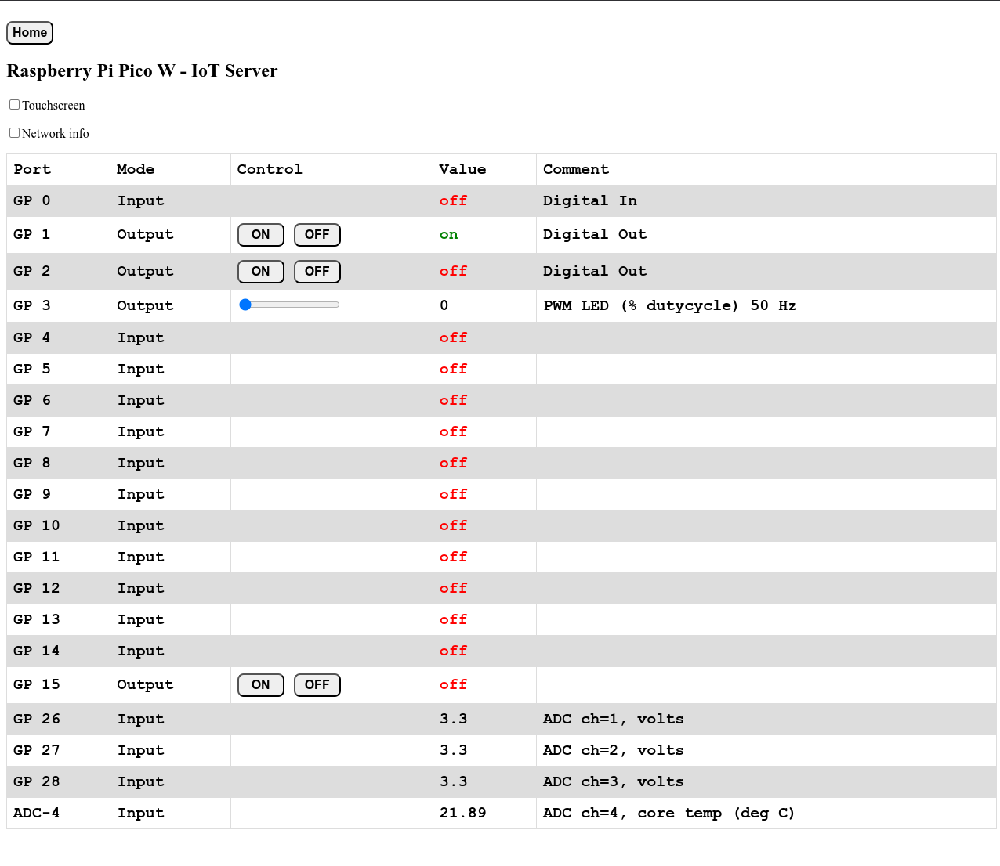

# Introduction

This software is used as an example when teaching my students IoT. It is made for the Raspberry Pi Pico W board and is programmed as Server. You must therefore connect to the Raspberry Pi Pico W via cabled or Wi-Fi network, and not directly to the Raspberry Pi Pico W. Look at the documentation within the source-code for more information about how to adapt and use the software.

## Basic use

To use this software, you must change the settings for WiFi name (SSID) and WiFi password for the connected network. I have a separate library file for this, placed outside the project area, to keep WiFi name/password hidden for others when showing this example/demo. You can alternatively put WiFi name/password directly in the code, and this is commented in the code.

To adapt the software for your needs, the simplest way of doing this is to change the values in the configuration table. Here you can specify wahat ports to use, input/output, digital/analog (PWM) and so on. This is commented in the code. Many students also like modify HTML-code, to change to more fancy colors, fonts, and so on.

### Configuration table in the code

    # Configuration of ports and functions
    # port_cfg[0] Active (1=Yes, 0=No)
    # port_cfg[1] Function (0 = Dig In, 1 = Dig Out, 2 = ADC In, 3 = PWM Out)
    # port_cfg[2] Value (and default value)
    #             For PWM, default value is PWM frequency, then PWM value is set to 0%
    # port_cfg[3] Name (GP port)
    # port_cfg[4] Comment (Description of port function)
    [1, 0, 0, "GP 0", "Digital In"],
    [1, 1, 1, "GP 1", "Digital Out"],
    [1, 1, 0, "GP 2", "Digital Out"],
    [1, 3, 50, "GP 3", "PWM LED (% dutycycle)"],
    [1, 0, 0, "GP 4", ""],
    [1, 0, 0, "GP 5", ""],
    [1, 0, 0, "GP 6", ""],
    [1, 0, 0, "GP 7", ""],
    [1, 0, 0, "GP 8", ""],
    [1, 0, 0, "GP 9", ""],
    [1, 0, 0, "GP 10", ""],
    [1, 0, 0, "GP 11", ""],
    [1, 0, 0, "GP 12", ""],
    [1, 0, 0, "GP 13", ""],
    [1, 0, 0, "GP 14", ""],
    [1, 1, 0, "GP 15", ""],
    [0, 0, 0, "GP 16", ""],
    [0, 0, 0, "GP 17", ""],
    [0, 0, 0, "GP 18", ""],
    [0, 0, 0, "GP 19", ""],
    [0, 0, 0, "GP 20", ""],
    [0, 0, 0, "GP 21", ""],
    [0, 0, 0, "GP 22", ""],
    [0, 0, 0, "GP 23", "Internal: Wireless Power On! Do not use!!!"],
    [0, 0, 0, "GP 24", "Internal: Wireless SPI Data. Do not use!!!"],
    [0, 0, 0, "GP 25", "Internal: Wireless SPI Chip-Select. Do not use!!!"],
    [1, 2, 0, "GP 26", "ADC ch=1, volts"],
    [1, 2, 0, "GP 27", "ADC ch=2, volts"],
    [1, 2, 0, "GP 28", "ADC ch=3, volts"],
    [1, 2, 0, "ADC-4", "ADC ch=4, core temp (deg C)"]

When using av device with touch-screen, you must activate use of touchscreen with the onscreen checkbox. If not, the sliders will probably not work.

## IDE

The software is made with [Thonny IDE](https://thonny.org/).

## Screenshots

